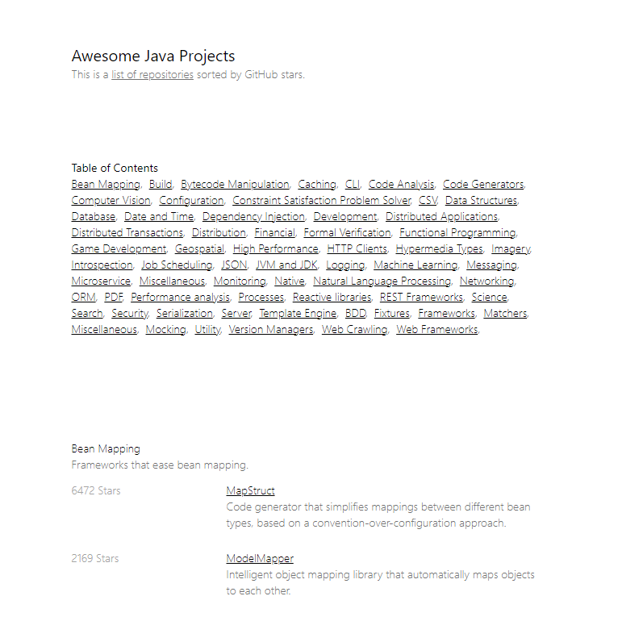

# Awesome Java by Stars

https://awesomejava.resamvi.io/

Check which Java libraries on GitHub have the most stars.



The list is based on [akullp/awesome-java](https://github.com/akullpp/awesome-java) and adds a web UI sorted by star counts.

## Install

Start a server on port `:8080` with
```
./gradlew run
```

When the request limit is reached a `GITHUB_TOKEN` should be provided
```
GITHUB_TOKEN=ghp_... ./gradlew run
```

## Contributing

Contributions are welcome, check [CONTRIBUTING](https://github.com/ResamVi/awesome-java-stars/blob/master/CONTRIBUTING.md)

